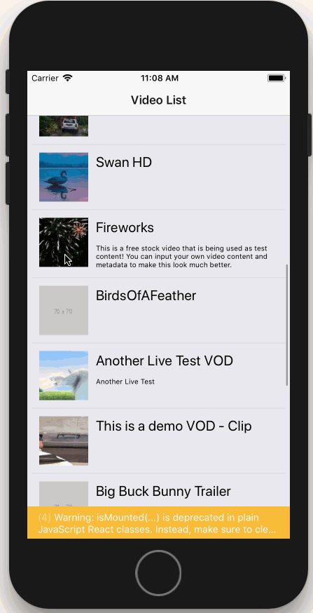

# Brightcove React Native Player Sample

A React Native implementation using [Brightcove Player](https://github.com/manse/react-native-brightcove-player) on top of the SDK.

## Installation

 ```
 $ yarn install
 $ cd ios; pod install; cd ..
 $ react-native link react-native-brightcove-player
 ```

## Config

You can edit the playlist, policyKey, etc, in the `config.js` file in the root of this folder.

Example:
```
{
	limit: 12,
	accountId: '12345646',
	policyKey: 'dfghjkl;',
	player: {
		autoplay: true
	}
}
```

## Running

### iOS

```
$ react-native run-ios
```

### Android

```
$ react-native run-android
```

## Preview


