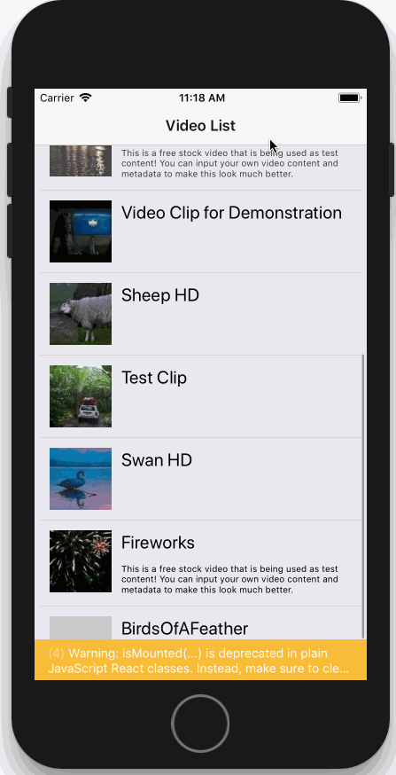
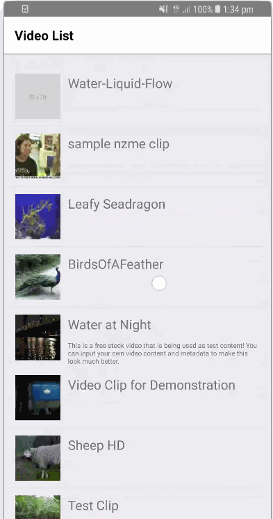

# Brightcove React Native Player Sample

A React Native implementation using [Brightcove Player](https://github.com/manse/react-native-brightcove-player) on top of the SDK.

## Installation

 ```
 $ yarn install
 $ cd ios; pod install; cd ..
 $ react-native link react-native-brightcove-player
 ```

## Config

You need to edit the playlist, policyKey, etc, in the `config.js` file in the root of this folder.

Example:
```
{
	limit: 15,
	accountId: '[YOUR ACCOUNT ID]',
	policyKey: '[YOUR POLICYKEY];',
	player: {
		autoplay: true
	}
}
```

To create a Policy key, use the policy api: https://docs.brightcove.com/policy-api/v1/doc/index.html

## Running

### iOS

```
$ react-native run-ios
```

### Android

```
$ react-native run-android
```

## Preview

**iOS**



**Andoid**



